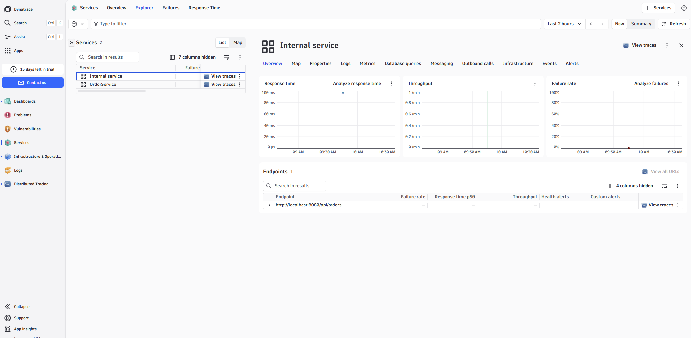
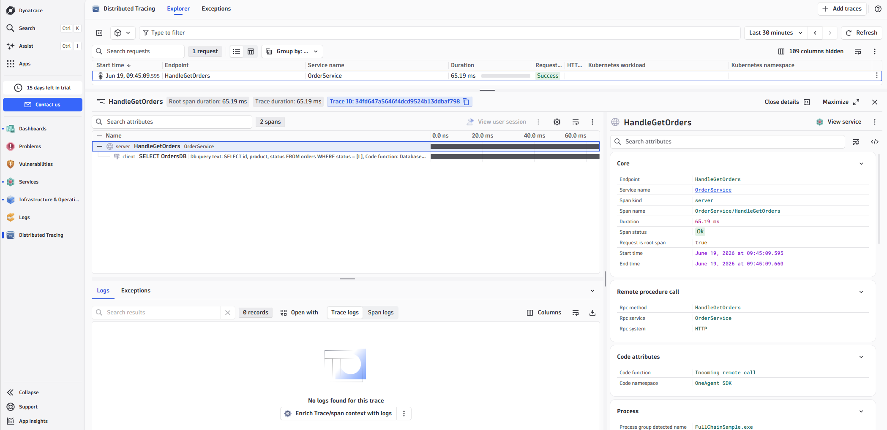
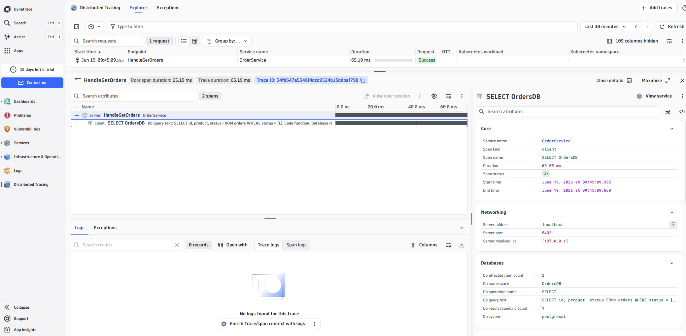

# OneAgent SDK for Delphi

Delphi bindings for the [Dynatrace OneAgent SDK for C/C++](https://github.com/Dynatrace/OneAgent-SDK-for-C), enabling distributed tracing and observability in Delphi applications that run on a host monitored by Dynatrace OneAgent.

The wrapper exposes the C SDK through a small, interface-based Delphi API: tracers for custom services, remote calls, HTTP requests and SQL database requests, plus tag propagation, custom request attributes and W3C trace-context access for log enrichment.

---

## ⚠️ Disclaimer — this is an unofficial, community project

**This repository is NOT affiliated with, endorsed by, sponsored by, or supported by Dynatrace LLC in any way.**

- It is an independent, community-maintained project that provides Delphi language bindings on top of the publicly available, Apache-2.0-licensed Dynatrace OneAgent SDK for C/C++.
- "Dynatrace", "OneAgent", and related names and logos are trademarks of **Dynatrace LLC**. They are used here **only** for descriptive/identification purposes to explain what this library integrates with. Their use does not imply any affiliation with or endorsement by Dynatrace LLC.
- Dynatrace LLC provides **no support, warranty, or maintenance** for this repository. Do **not** open support tickets with Dynatrace for issues related to this Delphi wrapper — use this project's issue tracker instead.
- This project is provided **"AS IS", without warranty of any kind**. You use it at your own risk. See the [LICENSE](LICENSE) for full terms.

For the official, Dynatrace-maintained SDKs, see the [Dynatrace OneAgent SDK on GitHub](https://github.com/Dynatrace/OneAgent-SDK).

---

## Why this exists

Dynatrace OneAgent already auto-instruments native Windows processes, so a lot is
captured without touching your code. This SDK is for what automatic instrumentation
**cannot infer on its own**:

- **Define custom service boundaries** around business operations (e.g. `processOrder` on `OrderService`).
- **Trace outgoing and incoming remote calls** and propagate the Dynatrace tag, so calls link across process and host boundaries into a single distributed trace.
- **Trace SQL database requests** with the statement, returned row count, and the database that was hit.
- **Trace outgoing HTTP requests**, and **enrich your logs** with the active W3C trace/span IDs.

There are official OneAgent SDKs for C/C++, Java, .NET, Node.js, PHP, Python, and Go —
but **none for Delphi**. This project provides Delphi-idiomatic bindings on top of the
C/C++ SDK so Delphi applications can take part in Dynatrace distributed tracing without
hand-writing the native C interop.

## What it looks like in Dynatrace

The screenshots below show traces produced by the `FullChainSample`
(client → HTTP server → database) as they appear in the Dynatrace UI.

Services automatically discovered from the SDK tracers:



A full distributed trace — from the incoming remote call through to the SQL database request:



Database request detail captured by the SDK (statement, endpoint, row count):



## Prerequisites

- Delphi 10.2 Tokyo or later (Unicode strings; tested on Windows targets)
- Windows **x86-64** (primary target) or **x86-32**
- Dynatrace OneAgent installed and running on the host to capture data.
  Without an agent the SDK is a safe **no-op** — your code keeps working, nothing is captured.

## Repository layout

| Path | Contents |
|------|----------|
| `src\` | The SDK units (the wrapper itself) |
| `lib\windows-x86_64\` | Prebuilt `onesdk_shared.dll` (64-bit) from the C SDK |
| `lib\windows-x86_32\` | Prebuilt `onesdk_shared.dll` (32-bit) from the C SDK |
| `samples\` | Runnable example applications |
| `OneAgentSDK.dpk` / `OneAgentSDKGroup.groupproj` | Package and project group for building in the IDE |

> The `onesdk_shared.dll` files under `lib\` are unmodified binaries from the
> [Dynatrace OneAgent SDK for C/C++](https://github.com/Dynatrace/OneAgent-SDK-for-C),
> redistributed here under the Apache License 2.0 for convenience. See [Licensing](#licensing).

## Adding to your project

1. Add `src\` to your project's **search path** (or add the units directly to your project, as the samples do).
2. Copy the matching `onesdk_shared.dll` next to your executable, or ensure it is on the `PATH`:
   - 64-bit: `lib\windows-x86_64\onesdk_shared.dll`
   - 32-bit: `lib\windows-x86_32\onesdk_shared.dll`
3. Add `OneAgentSDK` (and usually `OneAgentSDK.Types`) to your `uses` clause.

## Quick start

```delphi
uses
  OneAgentSDK, OneAgentSDK.Types;

var
  SDK    : IOneAgentSDK;
  Tracer : ITracer;
begin
  SDK := CreateOneAgentSDK;

  Tracer := SDK.TraceCustomService('processOrder', 'OrderService');
  Tracer.Start;
  try
    // ... your business logic ...
  except
    on E: Exception do
    begin
      Tracer.SetError(E.ClassName, E.Message);
      raise;
    end;
  end;
  Tracer.Finish;
end;
```

## SDK state

`CreateOneAgentSDK` always returns a safe, usable interface. When no compatible
agent is present, every tracer factory transparently returns a no-op tracer, so
no nil-checks or conditional compilation are needed. Use `GetCurrentState` to
inspect what is actually happening:

```delphi
case SDK.GetCurrentState of
  sdkActive             : // agent is monitoring, data is captured
  sdkTemporarilyInactive: // agent present but temporarily inactive; check again later
  sdkPermanentlyInactive: // agent will not become active (e.g. fork child, or no agent)
  sdkNotInitialized     : // initialization failed
  sdkError              : // unexpected state
end;
```

## Tracer types

### Custom service
```delphi
Tracer := SDK.TraceCustomService('methodName', 'ServiceName');
```

### Outgoing remote call (with tag propagation)
```delphi
var OutTracer: IOutgoingRemoteCallTracer;
OutTracer := SDK.TraceOutgoingRemoteCall(
  'GetUser', 'UserService', 'grpc://users:9090', ctTcpIp, 'users:9090');
OutTracer.Start;
// Send the DYNATRACE_HTTP_HEADERNAME header with OutTracer.GetDynatraceStringTag value.
```

### Incoming remote call (server side)
```delphi
var InTracer: IIncomingRemoteCallTracer;
InTracer := SDK.TraceIncomingRemoteCall('GetUser', 'UserService', 'grpc://users:9090');
InTracer.SetDynatraceStringTag(ReceivedHeaderValue); // before Start
InTracer.Start;
```

### Outgoing HTTP web request
```delphi
var WebTracer: IOutgoingWebRequestTracer;
WebTracer := SDK.TraceOutgoingWebRequest('https://api.example.com/v1/orders', 'GET');
WebTracer.AddRequestHeader('Accept', 'application/json'); // before Start
WebTracer.Start;
// Send DYNATRACE_HTTP_HEADERNAME header with WebTracer.GetDynatraceStringTag value.
// ... after the response ...
WebTracer.SetStatusCode(Response.StatusCode);
WebTracer.Finish;
```

### Database request
```delphi
var DbInfo: IDatabaseInfo;
DbInfo := SDK.CreateDatabaseInfo('mydb', DB_VENDOR_POSTGRESQL, ctTcpIp, 'db:5432');

var DbTracer: IDatabaseRequestTracer;
DbTracer := SDK.TraceSQLDatabaseRequest(DbInfo, 'SELECT * FROM users');
DbTracer.Start;
// ... execute query ...
DbTracer.SetReturnedRowCount(Count);
DbTracer.Finish;
```

### Log enrichment (W3C trace context)
```delphi
var Info: TTraceContextInfo;
Info := SDK.GetTraceContextInfo;
if Info.IsValid then
  Logger.Info(Format('[dt.trace_id=%s dt.span_id=%s] %s',
    [Info.TraceId, Info.SpanId, Message]));
```

### Custom request attributes
```delphi
SDK.AddCustomRequestAttribute('user.id', UserId);
SDK.AddCustomRequestAttribute('order.amount', Amount);  // Double overload
SDK.AddCustomRequestAttribute('retry.count', Int64(3)); // Int64 overload
```

## Thread affinity

All tracer interfaces have **strict thread affinity**: they must be created,
used (`Start`, `SetError`, `Finish`), and released on the **same thread**.
Do not pass tracer instances across threads.

## Samples

Each sample is a standalone Delphi project that includes the SDK units directly
from `src\`. Build and run them from the Delphi IDE (RAD Studio). The console
samples run safely even without an agent (they report state and exercise the API).

| Sample | What it shows |
|--------|---------------|
| `samples\CustomServiceSample\` | `TraceCustomService` with error handling and custom attributes |
| `samples\RemoteCallSample\`    | Outgoing + incoming remote call with tag propagation |
| `samples\DatabaseSample\`      | `CreateDatabaseInfo` + `TraceSQLDatabaseRequest` inside a service span |
| `samples\HttpRequestSample\`   | VCL app tracing an outgoing HTTP request |
| `samples\FullChainSample\`     | End-to-end client → HTTP server → database chain (Indy `TIdHTTPServer`) |

> Tracing data only appears in the Dynatrace UI when the OneAgent is active on
> the host. Database and outgoing-call traces additionally need an active
> PurePath (e.g. wrapped in an incoming remote call or custom service trace).

## Source files

| File | Purpose |
|------|---------|
| `src\OneAgentSDK.pas`          | Public interfaces, `CreateOneAgentSDK` factory, propagation-header constants |
| `src\OneAgentSDK.Types.pas`    | Enums, `TTraceContextInfo`, `DB_VENDOR_*` string constants |
| `src\OneAgentSDK.Native.pas`   | `external` DLL declarations, `TOnesdk_string`, string helpers |
| `src\OneAgentSDK.Impl.pas`     | Live implementation (wraps the C SDK) |
| `src\OneAgentSDK.NullImpl.pas` | No-op implementation (safe when the agent is absent) |

## Pointing the SDK at an agent without the installer

For local testing you can set stub variables **before** calling `CreateOneAgentSDK`:

```delphi
SetOneAgentSDKVariable('home', 'C:\oneagent');
SDK := CreateOneAgentSDK;
```

See the documentation comments on `SetOneAgentSDKVariable` for the supported keys.

## Licensing

This project is licensed under the **Apache License 2.0** — see [LICENSE](LICENSE)
and [NOTICE](NOTICE).

The prebuilt `onesdk_shared.dll` binaries under `lib\` are part of the
[Dynatrace OneAgent SDK for C/C++](https://github.com/Dynatrace/OneAgent-SDK-for-C),
copyright Dynatrace LLC, and are likewise distributed under the Apache License 2.0.
They are included unmodified for convenience; refer to the upstream repository for
their authoritative license and notices.

## Trademarks

"Dynatrace" and "OneAgent" are trademarks of Dynatrace LLC. All other trademarks
are the property of their respective owners. This project is not affiliated with
or endorsed by Dynatrace LLC (see the disclaimer at the top of this document).
